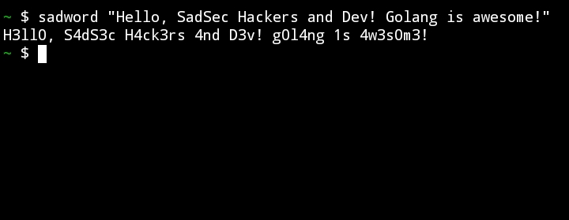

# sadword
Transform Ordinary Text into Leet (1337) Speak

## Overview
"sadword" is a delightful tool designed to add a touch of digital enchantment to your text. Harnessing the playful spirit of Leet (1337) speak, this utility transforms plain language into a captivating tapestry of characters, elevating your communication to a unique and artistic realm.

## Installation
To install "sadword," use the following `go install` command:

`go install github.com/AbdulConsole/sadword@latest`

Make sure your Go environment is properly configured, and the installation directory (commonly `$GOPATH/bin`) is included in your system's `PATH`.

## Usage
Once installed, "sadword" is a breeze to use. Simply run it from the command line, providing your original text as an argument:

`sadword "Hello, SadSec Hackers and Dev! Golang is awesome!"`

Let the magic unfold as your text transforms into Leet (1337) speak, adding a dash of digital charisma to your words.

## Future Improvements
We're committed to enhancing the "sadword" experience. Here are some planned improvements:

- *Interactive Mode:* An interactive mode for on-the-fly transformations.
- *Customizable Mappings:* Allowing users to define their own character mappings.
- *Support for Multiple Languages:* Expanding Leet (1337) transformations beyond English.
- 

We welcome contributions and feedback from the community to make "sadword" even more magical!